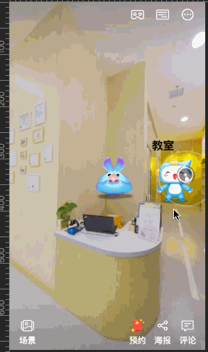
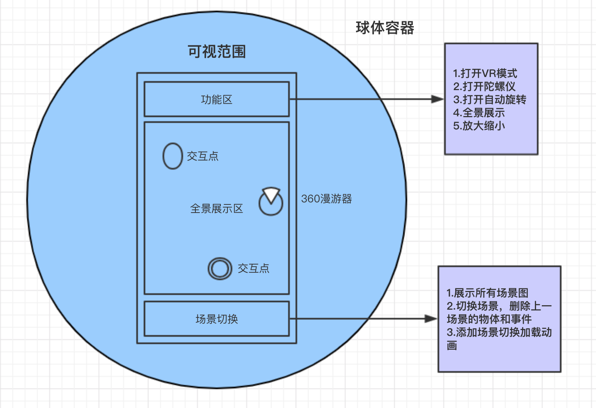
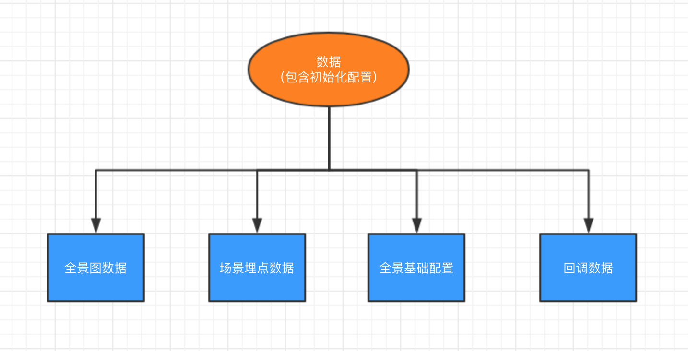

## owl-psv
> owl-psv 是一款3D全景生成插件，满足多场景切换、VR模式、全景缩放、内点定位等功能

### Example
[]()

### 安装
```js
npm install owl-psv
```

### 依赖
> three.js, sphoords.js, stats.js, tween.js

```html
<script src="%PUBLIC_URL%/static/three-71.min.js"></script>
<script src="%PUBLIC_URL%/static/sphoords.js"></script>
<script src="%PUBLIC_URL%/static/stats.min.js"></script>
<script src="%PUBLIC_URL%/static/Tween.min.js"></script>
```

### 使用文档

`初始化`
```js
var psv = new owlPSV()
```

`初始化配置`

参数 | 类型 | 含义 | 默认值
:---|:----|:----|:----
audios | object | 埋点点击音效 | 无
images | object | 埋点显示的帧动画 | 无
panoramas | array | 全景列表 | 无
data | array | 埋点坐标位置 | 无
container | element | 全景加载的div容器 | body
max_fov | number | 最大仰视角 | 90
default_position | object | 默认的位置 | { long: 0, lat: 0 }
anim_complated | function | 初始化加载动画完成 | 无
progress | function | 监听全景加载进度 | (msg) => ({ console.log(msg); })

`实例API`

API | 类型 | 含义 | 默认值
:---|:----|:----|:----
animateFrame | object | wegl中渲染帧动画的对象 | [详细API查看](#animateFrame)
createTween | function | 实现3D过渡动画 | orginObj,targetObj,delay,callback
controlMusic | function | 控制音乐 | false
initVideo | function | 初始化视频 | 无
controlVideo | function | 控制视频 | false
closeVideo | function | 关闭视频 | 无
changeColor | function | 改变场景叠加颜色 | [color]
changeMode | function | 改变场景模式 | 球体中心，球体外围
changeLong | function | 改变坐标经度 | [0-6]
zoomOut | function | 放大场景 | 无	
zoom | function | 修改场景的视场角 | [fov]
zoomIn | function | 缩小场景 | 无
toggleFullscreen | function | 切换全屏 | 无
toggleAutorotate | function | 切换自动旋转 | 无
toggleAuto | function | 切换自动FPS刷新 | 无
updatePanorama | function | 切换场景 | [texture] 
toggleStereo | function | 切换VR | 无 
toggleDeviceOrientation | function | 切换陀螺仪 | 无
fitToContainer | function | 重新计算屏幕可视范围 | 无
init | function | 场景初始化 | 无

### 效果展示


### 功能列表
* 多场景切换
* 自动旋转
* 放大缩小
* 全屏展示
* VR模式
* 陀螺仪
* 砸金蛋
* 全景内地里标志可触发

### 整体设计


### 插件结构
插件的设计如上所示。全景图片贴图到一个球体上面。人眼相机处于球体的中心。不断改变相机的观察点，一次来实现所有上下左右移动的人眼视觉效果。而不同的物体都有固定的x,y,z坐标，监听物体的点击事件，来绑定坐标位置和金蛋的交互事件处理。

### 数据提供
核心数据准备如下图所示：


### 未来规划
* 暂无